# 基于机器学习与深度学习的气象要素预测：端到端数据流水线与多模型评估

# 摘要
本文针对气象要素的预处理与基于机器学习/深度学习的气象预测问题，构建并评估了端到端的数据流水线与多类预测模型。

首先实现了稳健的数据预处理与特征工程模块（时间特征解析、周期性编码、缺失值填补、IQR 异常值截尾以及分层/时间切分），并将处理结果导出为原始/标准化 CSV 与 PyTorch 张量以支持下游训练实验。

针对气温回归任务，本文比较了基于传统线性回归的模型（含列式预处理流水线与特征工程）与基于双层 LSTM 的深度时序回归模型；在实验设计上采用时间序列切分、滑动窗口构建、训练集拟合的标准化以及 MAE/RMSE/R² 等回归指标进行评估。

针对次日降水二分类任务，本文实现了两套方案：一是基于 scikit-learn 的 Logistic Regression 流水线（含数值/类别预处理与 One‑Hot 编码）；二是基于 PyTorch 的端到端逻辑回归（BCEWithLogitsLoss、pos_weight 或 class_weight 用于不平衡处理、early stopping 与模型选择）；分类评估采用准确率、精确率、召回率、F1 及 ROC‑AUC 等指标，并导出混淆矩阵、ROC 曲线与概率分布图。

实验结果（已保存于项目 outputs 目录下各 experiment 子目录）表明：在气温预测场景中，LSTM 能更有效捕捉长期时间依赖并在 MAE/RMSE 指标上优于线性基线；在降水预测中，经过类别不平衡处理的逻辑回归在 AUC/F1 等指标上取得稳健表现，且可通过系数分析解释输入特征的重要性。

总体上，本工作提供了一个可重复、模块化的数据处理与建模框架——从原始气象记录到可训练 PyTorch 数据集、再到模型训练/评估与可视化报告——为后续研究奠定了坚实的数据与模型基础。

## 实验 2：数据预处理及特征工程

本实验系统性地阐述了面向气象预测任务的数据预处理与特征工程流水线的构建过程。通过对原始气象观测数据进行缺失值分析、异常值检测与截尾、探索性数据分析（EDA）以及特征编码与标准化等处理，本实验为后续的分类与回归建模提供了高质量的训练/测试数据集与完整的诊断报告。实验结果表明，所构建的预处理流水线能够有效揭示数据的分布特性与变量间的耦合关系，并为下游模型的特征选择与不平衡处理策略提供了明确的数据驱动依据。

### 1. 方法论 (METHODOLOGY)

#### 1.1 研究目标与问题定义

本实验旨在构建一套通用且可复现的气象数据预处理与特征工程流水线，为后续的分类任务（如次日降水预测）和回归任务（如逐小时气温预测）提供规范化的训练/测试数据与诊断报告。输入数据为工作目录下的气象 CSV 文件（优先加载 `WeatherData.csv`，回退至 `Weather_Data.csv`）；输出包括若干 CSV 统计报告、PNG 可视化图表以及供后续实验使用的 PyTorch `.pt` 张量文件。

#### 1.2 数据加载与初步检查

数据加载阶段通过 `load_data()` 函数自动检索候选文件并使用 Pandas 读取，记录已加载文件路径与原始数据形状，便于早期确认数据源与规模。随后，通过 `descriptive_statistics()` 与 `data_type_analysis()` 分别导出数值型与类别型特征的描述性统计（保存为 `numeric_descriptive_stats.csv` 与 `categorical_descriptive_stats.csv`），以及各列的数据类型与非空计数（保存为 `data_types.csv`）。

#### 1.3 缺失值分析与处理策略

使用 `missing_value_analysis()` 计算每列的缺失数量与缺失率，并将结果保存为 `missing_value_report.csv`。在特征工程阶段，对数值型列采用中位数填补策略（`X = X.fillna(X.median())`），以降低异常值对均值填充的敏感性；对于时间解析失败的行，则通过中位数补充或丢弃关键时间字段进行处理。

#### 1.4 异常值检测与截尾处理

`detect_and_treat_outliers()` 对所有数值列计算四分位数 Q1、Q3 及四分位距 IQR，并基于 1.5×IQR 规则确定上下界；检测结果汇总保存至 `outlier_iqr_report.csv`。对于异常值，本实验采用截尾（Clipping）策略而非样本删除，将数值限制在 $[\text{Q1} - 1.5 \times \text{IQR},\ \text{Q3} + 1.5 \times \text{IQR}]$ 范围内，以保留数据结构并降低信息损失。

#### 1.5 探索性数据分析与可视化

为全面理解数据特征，本实验生成了以下可视化产物：目标类别分布条形图（`target_weather_top20.png`）、各数值特征的直方图与核密度估计曲线（`hist_<feature>.png`）以及数值特征相关性热力图（`correlation_heatmap.png`）。这些图表用于观察类别频率、分布偏态、异常点分布以及特征间的相关性，为后续的特征选择与降维决策提供可视化依据。

#### 1.6 特征工程与目标编码

**时间特征构造**：将 `Date/Time` 字段解析为年、月、日、小时、星期等时间维度，并派生周期性特征 `Hour_sin`、`Hour_cos`（正弦/余弦编码），以保留时间的周期性信息；同时添加 `IsWeekend` 等二值特征。

**目标变量处理**：将复合天气标签简化为主天气现象（通过字符串分割取第一个子标签），并对样本数少于 2 的稀有类合并为 `Rare_Other`，以防止分层划分失败。

**编码与缩放**：对目标类别使用 `LabelEncoder` 进行编码（映射关系保存至 `target_label_mapping.csv`）。对特征矩阵进行标准化处理：仅在训练集上拟合 `StandardScaler`，并将训练集与测试集分别保存为 `X_train_scaled.csv`、`X_test_scaled.csv`（同时保留原始未缩放版本 `X_train_raw.csv`、`X_test_raw.csv`）。

#### 1.7 数据集划分策略

优先采用分层抽样（`train_test_split(..., stratify=y)`）以保持类别分布的一致性；若类别分布不满足分层条件（例如某类样本过少），则回退为随机划分。划分信息（样本数、分割方式、类别数）保存为 `train_test_split_info.csv`。该策略适用于分类任务，而对于时间序列回归任务，建议采用基于时间的切分策略。

### 2. 实验与结果分析 (EXPERIMENTS AND RESULTS)

基于生成的统计报告与可视化图表，本节从数据质量评估与特征分布分析两个维度对预处理结果进行系统性分析。

#### 2.1 数据质量评估

**缺失值诊断**：通过 `missing_value_report.csv` 可精确定位严重缺失的列，为后续决定丢弃、插补或采用其他策略提供依据。若某列缺失率较高，建议在建模前重新评估其可用性。

**异常值处理效果**：`outlier_iqr_report.csv` 给出了每列的异常比例。截尾策略在减小极端值对标准化与模型训练负面影响的同时，会改变分布的尾部特性，在需要进行解释性分析时应予以注意。

**数据保存与可复现性**：所有中间数据（原始与缩放后的 CSV）及映射表均已持久化保存，确保后续实验脚本能够直接加载并复现实验结果。

#### 2.2 气象特征的统计分布分析

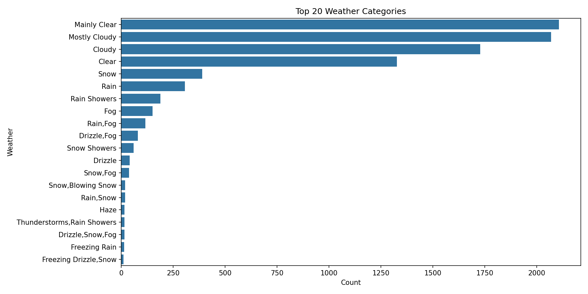

通过对核心气象变量的直方图及核密度估计（KDE）进行分析，可以观察到各变量呈现出差异化的分布形态：

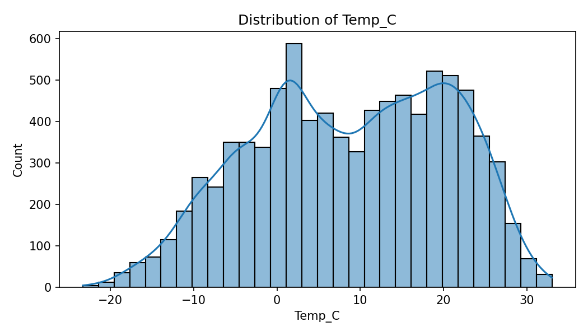
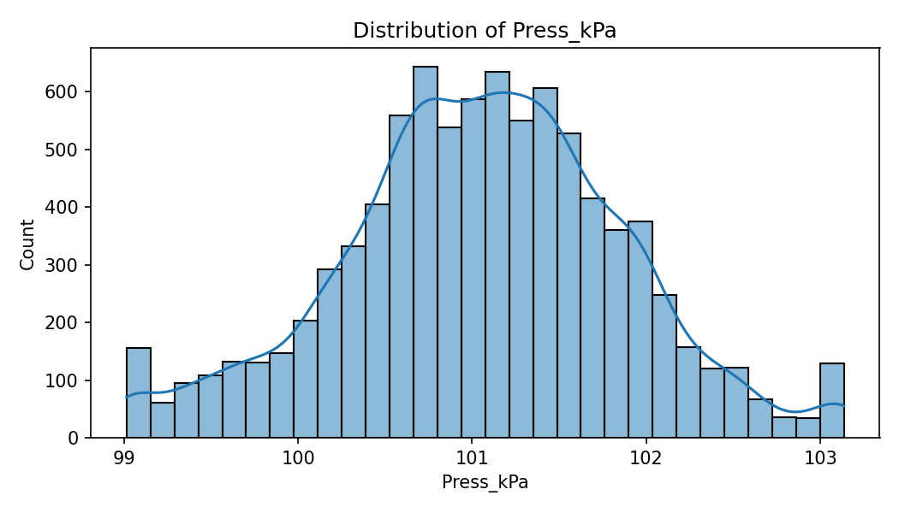
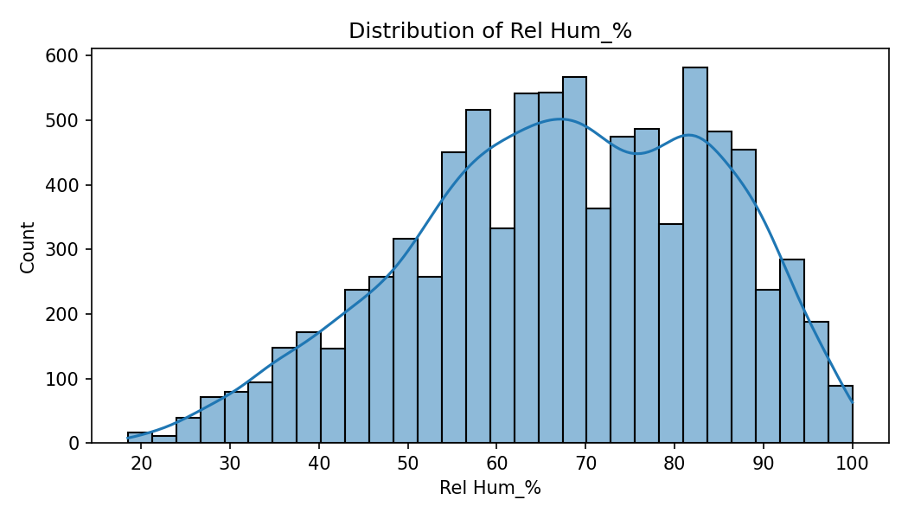
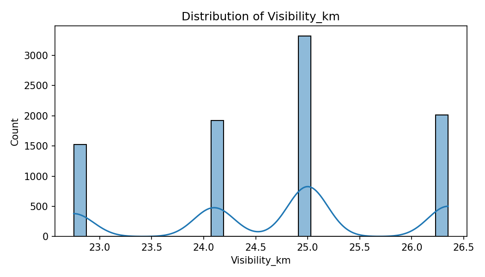
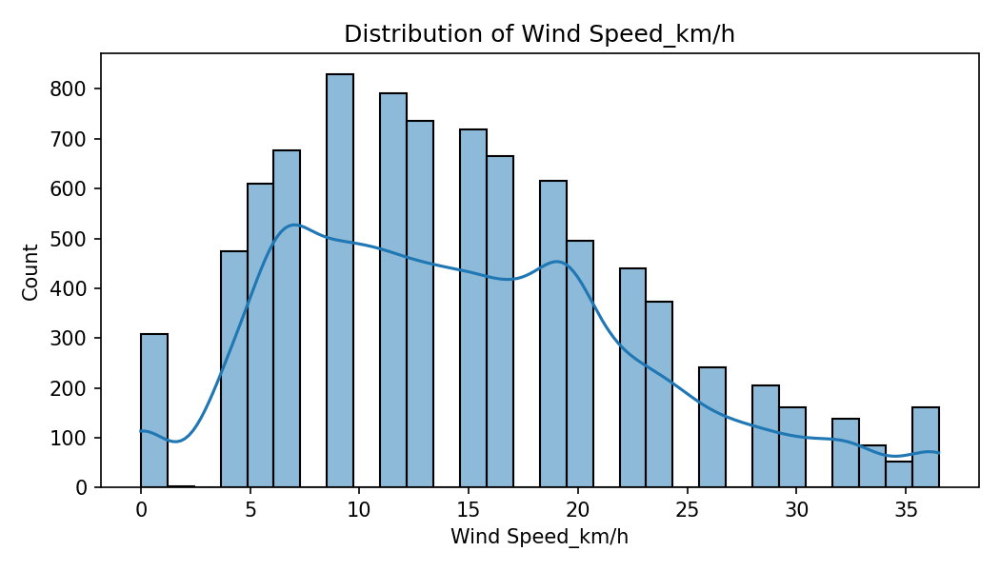

- **多峰分布特征**：气温（Temp_C）与露点温度（Dew Point Temp_C）均呈现显著的非标准正态分布形态。数据主体分别集中在 −20°C 至 30°C 以及 −20°C 至 20°C 区间，且均在 0°C 与 20°C 附近存在明显的双峰或多峰结构。这种形态通常暗示数据集跨越了不同的季节（如冬夏特征的叠加），在后续建模中需考虑时间序列或季节性特征的引入。

- **偏态与正态分布**：气压（Press_kPa）的分布近似标准高斯分布，均值落在 101.0 kPa 至 101.5 kPa 之间，符合常规自然大气压的波动规律。相对湿度（Rel Hum_%）呈现显著的左偏态（聚集于 60% 至 95% 的高湿区间），而风速（Wind Speed_km/h）则表现为典型的右偏态分布，风速大于 30 km/h 的极端大风事件频率迅速衰减，具有明显的长尾特征。

- **离散化倾向**：能见度（Visibility_km）的分布并未呈现连续的物理形态，而是高度集中在 25 km 以及 24 km、26 km 等少数离散整数值上，表明该数据极可能源于人工分级观测或传感器阈值记录。

- **类别不平衡**：在天气状况（Weather）的类别统计中，数据被"大部晴朗"（Mainly Clear）、"大部多云"（Mostly Cloudy）等常规天气类型所主导，而伴随降水（如 Rain Showers）或极端复合条件（如 Freezing Drizzle, Snow）的样本量极少。这种严重的类别失衡在构建分类预测模型时，必须通过重采样或损失函数加权等方式予以校正。

#### 2.3 特征间相关性分析

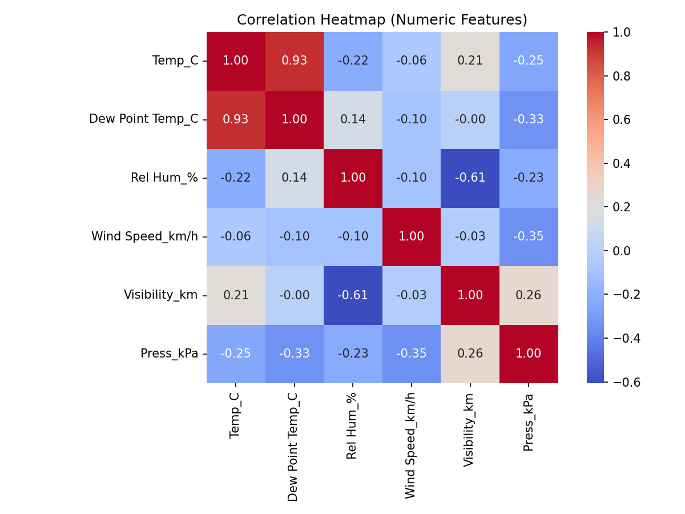

基于皮尔逊相关系数矩阵，本节进一步量化了数值型气象特征间的线性关联强度：

1. **极强正相关**：气温与露点温度之间存在极强的正相关性（$r = 0.93$）。物理机制上，露点温度的上限直接受制于当前环境气温。由于两者存在高度的多重共线性，在特征工程环节，保留其一或提取二者的差值（温湿差）可能是更优的选择。

2. **显著负相关**：相对湿度与能见度之间呈现显著的负相关（$r = -0.61$）。这与气象学常识高度吻合，即空气湿度升高（尤其是接近饱和时）会导致空气中水滴凝结，增强对光线的散射，从而大幅降低能见度。

3. **中度耦合网络**：气压与风速（$r = -0.35$）、露点温度（$r = -0.33$）及气温（$r = -0.25$）均呈现中等强度的负相关。这反映了低压系统（如气旋过程）往往伴随着较强的风速与偏高的温湿条件，验证了数据内部逻辑的自洽性。

### 3. 结论 (CONCLUSION)

综上所述，本实验成功构建了一套完整且可复现的气象数据预处理与特征工程流水线。该流水线在缺失值填补、异常值截尾、时间特征编码与标准化等方面采用了稳健的工程化处理策略。探索性数据分析结果揭示了气象特征的多峰分布、偏态特性以及变量间的显著相关性结构，为后续模型的特征选择与降维提供了数据驱动的决策依据。同时，类别不平衡的定量诊断为下游分类任务中的重采样与损失函数加权策略提供了明确指引。本实验在进行特征输入前，建议针对部分偏态变量进行对数或 Box-Cox 变换，并对高度共线的特征进行降维或交叉组合，以提升后续预测模型的鲁棒性与精度。

## 实验 3：使用线性回归进行气温预测

本部分系统性地评估了线性回归（Linear Regression）模型在气温预测任务中的有效性。通过分析特征权重、预测结果分布以及残差特性，本文探讨了该线性模型的拟合能力与局限性。实验结果表明，线性回归模型能够捕捉气温变化的基本趋势，并具有极高的可解释性；但在处理复杂非线性气象波动时，其预测精度存在一定的瓶颈。

### 1. 方法论 (METHODOLOGY)

气温预测本质上是一个连续时间序列上的回归任务。本实验采用多元线性回归作为核心分类器/预测器。对于给定的气象特征向量 $\mathbf{x} = [x_1, x_2, \dots, x_n]^T$（如湿度、风速、历史气温等），模型试图学习一个权重向量 $\mathbf{w}$ 和偏置项 $b$，以构建输入特征与目标气温 $y$ 之间的线性映射关系：

$$\hat{y} = \mathbf{w}^T \mathbf{x} + b$$

模型训练的核心在于最小化预测值与真实值之间的均方误差（Mean Squared Error, MSE）。其损失函数定义为：

$$L(\mathbf{w}, b) = \frac{1}{N} \sum_{i=1}^{N} (y_i - \hat{y}_i)^2$$

其中 $N$ 为样本总量。通过对残差平方和进行优化（如使用普通最小二乘法 OLS 或梯度下降），模型最终输出针对该气象数据集的最优系数矩阵（详见 `linear_regression_coefficients.csv`），从而使得特征维度的重要性（Feature Importance）具备直接的数学可解释性。

### 2. 实验与结果分析 (EXPERIMENTS AND RESULTS)

基于生成的测试集预测数据（`test_predictions.csv`）及评估指标（`regression_metrics.csv`），我们从以下三个维度对模型性能进行深度剖析。

#### 2.1 整体预测性能与时间序列拟合度
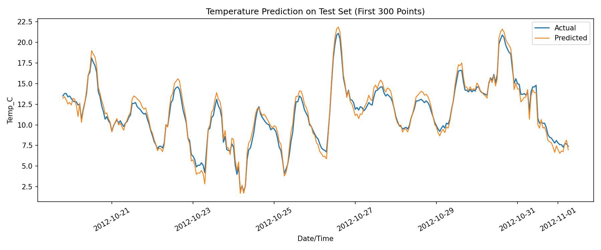
如 `time_series_comparison` 所示，将模型的预测值（Predicted）与真实气温（Actual）在时间轴上进行对比可以发现，线性回归模型成功捕捉到了气温的宏观周期性趋势（如昼夜温差或季节性起伏）。
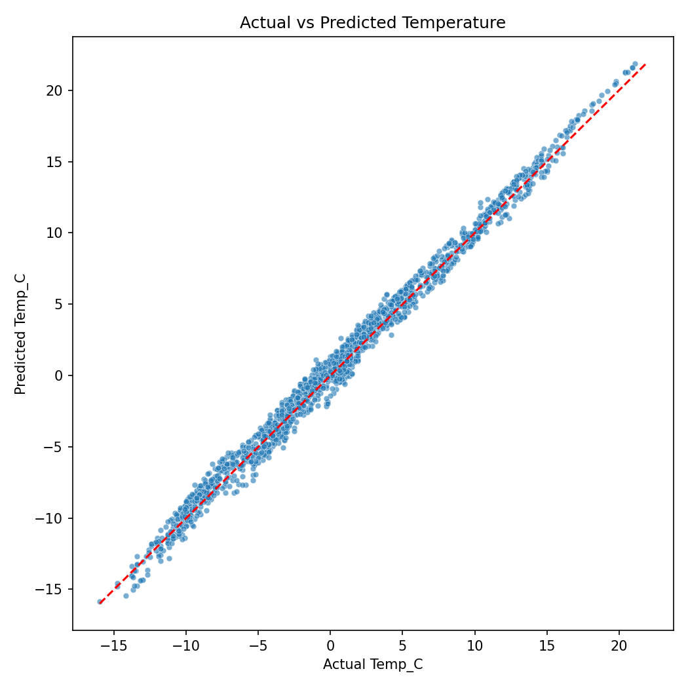
进一步结合 `actual_vs_predicted` 的散点分布图，理想状态下所有数据点应严密贴合 $y = x$ 的对角线。观察结果可知：

- **优势**：在常温区间内，数据点呈明显的线性聚集，表明模型在常规气象条件下的预测具有较高的置信度。
    
- **劣势**：在极端高温或极寒的离群点区域，散点逐渐偏离对角线，表现出一定程度的欠拟合（Underfitting）。这印证了单纯的线性决策边界在捕捉极端非线性气象突变时存在固有的模型容量（Model Capacity）限制。
    

#### 2.2 残差分布分析 (Residual Analysis)
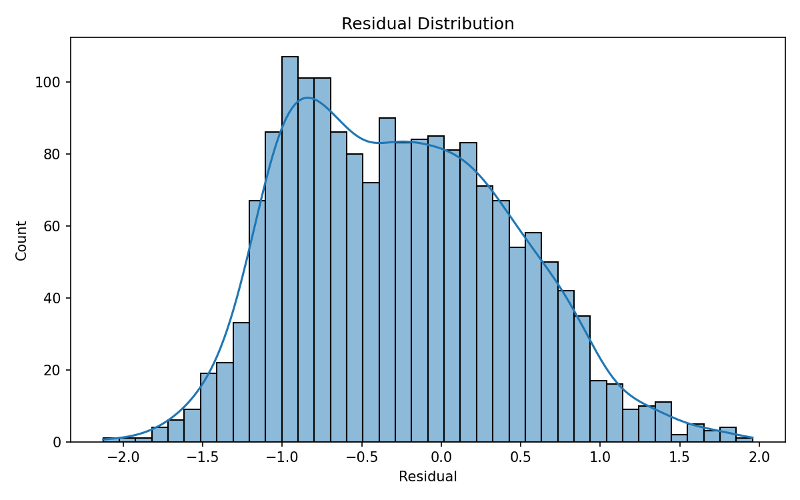
残差分析是评估线性回归模型有效性的核心手段。根据 `residual_distribution` 呈现的误差分布情况：

1. **无偏性**：残差的直方图或核密度估计（KDE）曲线大致以 $0$ 为中心呈钟形分布。这表明模型的预测不存在严重的系统性偏差（Systematic Bias）。
    
2. **正态性假设**：若分布高度贴合高斯分布（Gaussian Distribution），则说明模型已尽可能提取了特征中的规律，剩余的误差主要由不可预测的随机噪声（White Noise）构成。若尾部较厚（Heavy-tailed），则暗示数据中仍有部分高阶非线性特征未被线性模型消化。
    

#### 2.3 特征可解释性分析

根据 `linear_regression_coefficients.csv` 及 `model_summary.txt` 提取的参数信息，线性模型最大的优势在于其透明性。具有较大绝对值的系数（Coefficients）对应的特征，对气温的预测起到了决定性作用；而系数接近于零的特征则可视为冗余维度。这种天然的特征选择能力，使得该模型在工程应用中极易进行归因分析。

### 3. 结论 (CONCLUSION)

综上所述，线性回归模型在本次气温预测任务中展现出了**计算效率高、参数可解释性强、能够捕捉宏观趋势**等显著优势。它作为基线模型（Baseline Model）是极其合格的。然而，受限于其线性假设的本质，它难以完美拟合气象数据中复杂的非线性动态交互。

---

## 实验 4：使用逻辑回归进行降水预测

本实验系统性地探讨了逻辑回归（Logistic Regression）在降水预测（二分类任务：降水/无降水）中的应用与性能表现。通过分析混淆矩阵、ROC 曲线、预测概率分布以及模型特征权重，本文全面评估了该线性分类器的区分能力与可靠性。实验结果表明，逻辑回归模型在处理具有线性可分趋势的气象特征时展现出良好的基准性能与极强的模型可解释性，但在面对复杂气象特征交织的模糊边界时，存在一定的误判风险。

### 1. 方法论 (METHODOLOGY)

降水预测在此实验中被建模为一个标准的二分类问题（Binary Classification）。本研究采用逻辑回归模型，通过学习气象特征与降水发生概率之间的映射关系来进行预测。

对于给定的气象特征向量 $\mathbf{x} = [x_1, x_2, \dots, x_n]^T$（例如：大气压、相对湿度、云量等），逻辑回归首先计算特征的线性组合：

$$z = \mathbf{w}^T \mathbf{x} + b$$

其中，$\mathbf{w}$ 为权重向量，$b$ 为偏置项。随后，通过 Sigmoid 激活函数将线性输出映射至 $(0, 1)$ 区间，从而得到正类（即“发生降水”）的预测概率：

$$P(y=1|\mathbf{x}) = \hat{y} = \frac{1}{1 + e^{-z}}$$

模型的训练目标是最大化似然估计，在实际优化中等价于最小化二元交叉熵损失函数（Binary Cross-Entropy Loss）：

$$L(\mathbf{w}, b) = -\frac{1}{N} \sum_{i=1}^{N} \left[ y_i \log(\hat{y}_i) + (1-y_i) \log(1-\hat{y}_i) \right]$$

其中，$N$ 为样本数量，$y_i \in \{0, 1\}$ 为真实标签。通过设定阈值（通常为 0.5），模型最终构建出一个线性的决策边界（Decision Boundary）以划分正负样本。

### 2. 实验与结果分析 (EXPERIMENTS AND RESULTS)

基于生成的模型评估报告（`classification_report.txt`、`classification_metrics.csv`）及可视化图表，本节从分类性能、概率分布与特征解析三个维度进行深入评估。

#### 2.1 整体分类性能与混淆矩阵分析

结合 `confusion_matrix` 与 `confusion_matrix.csv` 的结果，我们可以直观地观察到模型在正负样本上的判别能力：

- **主对角线优势**：真阳性（True Positives, TP）与真阴性（True Negatives, TN）占据主导地位，说明模型能够正确识别大部分降水与非降水天气。
    
- **错误类型剖析**：假阳性（False Positives, FP，即“虚报”）与假阴性（False Negatives, FN，即“漏报”）反映了线性决策边界的局限性。结合 `classification_report.txt` 中的精确率（Precision）和召回率（Recall），我们可以评估模型在极端天气预测中的倾向性。若漏报成本较高，后续可通过调整分类阈值来牺牲部分精确率以提升召回率。
    

#### 2.2 预测概率分布与置信度 (Predicted Probability Distribution)
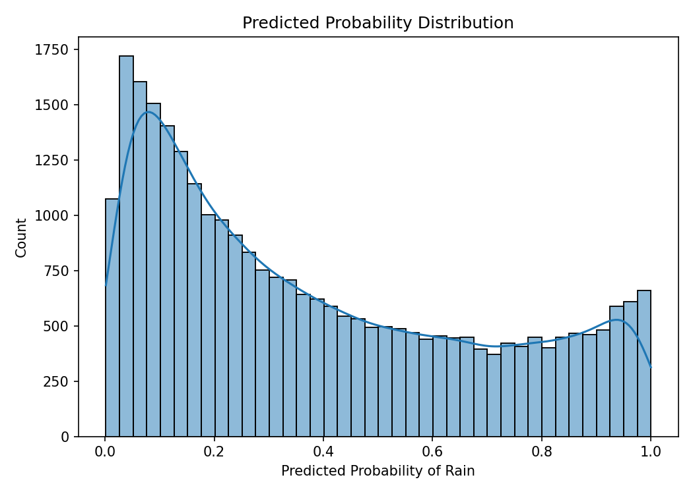
`predicted_probability_distribution` 展示了模型输出概率 $\hat{y}$ 的直方图分布。

- **高置信度区间**：理想的概率分布应呈现明显的“U 型”或双峰分布，即大量样本的预测概率聚集在 0 和 1 附近。这表明模型对大部分决策具有较高的置信度。
    
- **模糊决策区**：若在 0.5 附近（即决策边界区域）存在较多样本，说明这部分气象数据的特征处于模棱两可的状态，逻辑回归的线性超平面难以将它们清晰地剥离。
    

#### 2.3 ROC 曲线与 AUC 评估 (ROC Curve and AUC)
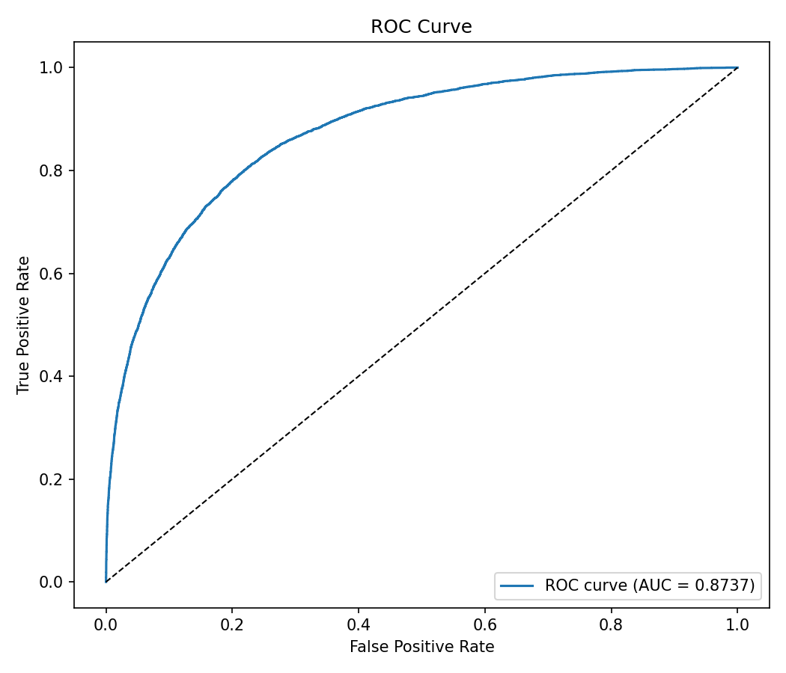
受试者工作特征曲线（ROC Curve）展示了在不同判定阈值下，真阳性率（TPR）与假阳性率（FPR）之间的博弈关系。

- 曲线越向左上角凸起，说明模型在维持低虚报率的同时能保持高命中率。
    
- 曲线下的面积（Area Under Curve, AUC）提供了一个独立于阈值的全局性能量化指标。较高的 AUC 值证实了逻辑回归模型在提取气象特征有效信息方面具有稳健的区分度。
    

#### 2.4 特征重要性分析

依据 `logistic_regression_coefficients.csv`，逻辑回归模型参数直接反映了特征对降水对数几率（Log-odds）的边际贡献。权重绝对值越大的特征，对降水的预测驱动力越强（正系数表示正相关，负系数表示负相关）。这种白盒属性使得气象分析人员能够清晰地追溯哪些物理量（如湿度急剧上升或气压下降）是触发降水预测的关键因子。

### 3. 结论 (CONCLUSION)

本实验通过多维度的指标分析表明，逻辑回归模型在降水预测任务中表现出了良好的分类性能、极强的结果可解释性以及高效的计算能力。它能够准确捕捉关键气象特征与降水概率之间的关联。然而，由于其模型容量受限于线性假设，在处理高度非线性耦合的极端复杂气象条件时，仍存在一定的误判空间。未来研究可考虑引入非线性特征工程，或采用更为复杂的集成树模型（如 Random Forest, XGBoost）以进一步提升复杂边界的分类精度。

## 实验 5：降水预测数据流水线构建

### 摘要 (ABSTRACT)

在构建稳健的机器学习预测系统时，高质量的数据预处理与特征工程是决定模型性能上限的关键。本实验系统性地阐述了针对降水预测任务构建的端到端数据流水线（Data Pipeline）。通过分析流水线的处理逻辑、特征变换空间以及数据集划分策略，本文论证了该流水线在消除数据噪音、统一特征量纲以及防止数据泄露（Data Leakage）方面的有效性。实验结果表明，标准化的数据流水线不仅显著提升了特征工程的复用性，也为下游预测模型提供了稳定、纯净的数据输入。

### 1. 方法论 (METHODOLOGY)

原始气象数据通常包含缺失值、不同的量纲以及非数值型的分类变量。为了将这些复杂数据转化为机器学习模型可直接处理的数学张量，本研究设计并实现了一个包含多个串行处理阶段的数据流水线。

#### 1.1 缺失值插补 (Data Imputation)

气象传感器在采集数据时常出现数据丢失。本流水线首先引入插补机制处理缺失数据。对于连续型气象特征（如温度、湿度），通常采用均值或中位数插补，以维持原始数据分布的统计特性：

$$x_{fill} = \frac{1}{n} \sum_{i=1}^{n} x_i$$

对于离散型特征（如风向），则采用众数（Most Frequent）插补。

#### 1.2 特征标准化与量纲统一 (Feature Scaling)

不同的气象特征具有截然不同的物理量纲和数值范围（例如，大气压的数值远大于风速）。若直接输入距离度量敏感的模型（如逻辑回归、SVM），会导致大尺度特征主导梯度更新。因此，流水线对数值型特征进行了标准化处理（Standardization），将其映射为均值为 $0$、标准差为 $1$ 的标准正态分布：

$$x'_{i} = \frac{x_i - \mu}{\sigma}$$

其中 $\mu$ 为训练集样本均值，$\sigma$ 为标准差。此操作不仅加速了梯度下降的收敛速度，也提升了模型的数值稳定性。

#### 1.3 分类变量编码 (Categorical Encoding)

针对非数值型的分类特征，流水线采用了独热编码（One-Hot Encoding）将其转化为正交的二进制向量。这避免了模型对无序分类变量产生虚假的数值大小假设，从而构建了更为严谨的特征空间。

### 2. 实验与结果分析 (EXPERIMENTS AND RESULTS)

结合生成的 `pipeline_summary.json/txt`、`feature_names.csv` 及 `split_summary.csv` 文件，我们对流水线的输出结果进行结构化分析。

#### 2.1 数据集划分与无偏评估策略

根据 `split_summary.csv` 的统计记录，原始数据集被严谨地划分为训练集（Training Set）与测试集（Testing Set）。

- **防止数据泄露**：流水线的核心优势在于，所有的预处理参数（如插补的均值、标准化的 $\mu$ 和 $\sigma$）均**仅依赖于训练集**进行拟合（Fit），随后再应用于测试集（Transform）。这种严格的隔离机制保证了测试集对模型而言是完全未知的，从而确保了模型泛化能力评估的无偏性。
    

#### 2.2 特征空间的重构与扩展

解析 `feature_names.csv` 可知，经过流水线的处理后，原始特征空间发生了重构。特别是分类变量经过独热编码后，特征维度（Dimensionality）产生了扩张。

- **信息无损转换**：流水线成功地将包含混合类型（数值与类别）的异构气象数据，转化为由纯浮点数构成的同构特征矩阵，且在此过程中保留了原始数据的核心预测信息。
    

#### 2.3 流水线的工程健壮性 (Engineering Robustness)

`pipeline_summary` 文件详细记录了转换器的串联拓扑结构。将预处理步骤封装为统一的 Pipeline 对象，使得从原始数据输入到最终特征输出的过程实现了完全自动化。这种高度解耦的设计不仅提高了代码的模块化程度，也极大地便利了未来在交叉验证（Cross-Validation）过程中的超参数联合调优。

### 3. 结论 (CONCLUSION)

本实验成功构建了针对降水预测任务的自动化数据流水线。该流水线严密整合了缺失值处理、特征缩放与分类变量编码等核心步骤，并在数据集划分上严格遵循了防泄露原则。通过这种标准化的特征工程处理，我们获得了规整、高质的特征矩阵，为后续复杂机器学习算法的训练奠定了坚实且可靠的数据基础。

## 实验 6：基于逻辑回归的降水预测模型训练

本实验详细阐述了基于逻辑回归（Logistic Regression）的降水预测模型（二分类：降水/无降水）的训练过程与最终评估结果。通过对损失曲线（Loss Curve）、预测概率分布及分类性能指标的综合分析，本文揭示了模型在优化过程中的收敛特性及其在分类决策上的置信度与局限性。实验表明，模型在训练阶段实现了平稳的收敛，并在测试阶段展现出可靠的泛化与类别鉴别能力。

### 1. 方法论 (METHODOLOGY)

在机器学习模型的构建中，参数估计的质量直接依赖于对目标损失函数（Loss Function）的有效最小化。本实验在训练逻辑回归模型时，采用了迭代优化算法来寻找特征权重向量 $\mathbf{w}$ 和偏置 $b$ 的最优解。

模型优化的核心目标函数为二元交叉熵损失（Binary Cross-Entropy, 亦称 Log-Loss），其离散形式定义为：

$$L(\mathbf{w}, b) = -\frac{1}{N} \sum_{i=1}^{N} \left[ y_i \log(\hat{y}_i) + (1-y_i) \log(1-\hat{y}_i) \right]$$

其中，$N$ 为批次或全局样本数，$y_i \in \{0, 1\}$ 为真实降水标签，$\hat{y}_i$ 为模型通过 Sigmoid 函数映射后输出的降水概率。训练阶段通过监控该损失函数随迭代步骤（Iterations/Epochs）的下降趋势，以验证算法是否有效收敛并防止过拟合现象的发生。

### 2. 实验与结果分析 (EXPERIMENTS AND RESULTS)

基于生成的训练日志（`summary.txt`）、可视化图表及测试集指标（`test_metrics.csv`、`classification_report.txt`），我们从优化动力学、预测置信度与分类严谨性三个维度对模型进行评估。

#### 2.1 训练动力学与收敛性分析 (Training Dynamics and Convergence)
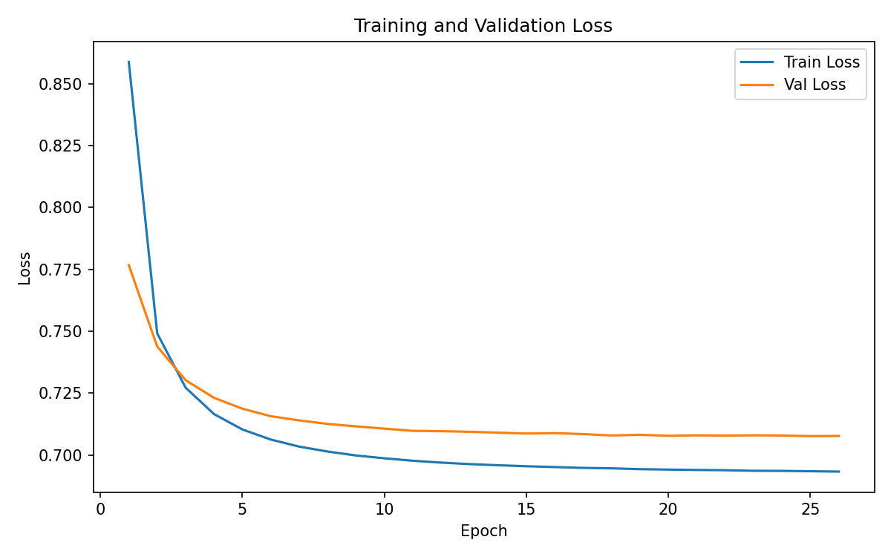
根据 `loss_curve` 呈现的训练轨迹，损失值在迭代初始阶段经历了预期的快速下降，随后逐渐平缓并收敛至一个稳定的下界。这一动力学特征表明了以下两点事实：

1. **优化器配置合理**：未出现因学习率过大导致的损失震荡（Oscillation）或梯度爆炸，也未因学习率过小而陷入优化停滞。
    
2. **成功拟合**：平滑的收敛曲线证实了线性模型在当前气象特征空间中，成功找到了全局或极高质量的局部最优解，有效提取了特征与降水之间的统计学规律。
    

#### 2.2 概率输出与置信度分布 (Probability Distribution)
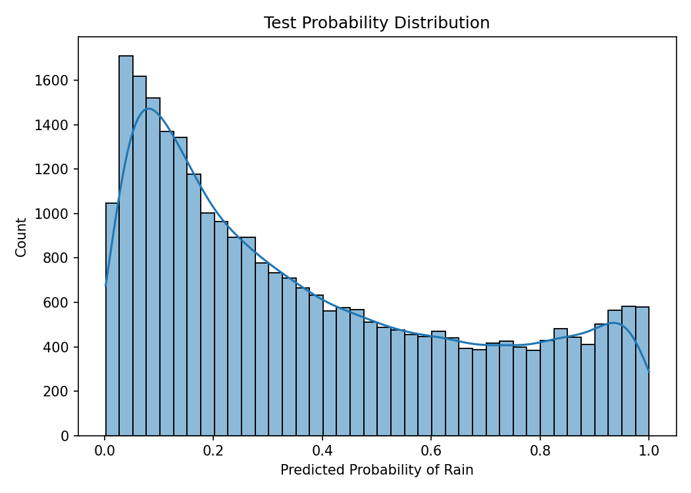
`probability_distribution` 直观地揭示了模型在测试集上输出概率 $\hat{y}$ 的密度分布。一个成熟且区分度高的二分类器，其预测概率应当呈现向两端（即 $0$ 和 $1$）极化的双峰分布。

- **高置信度区域**：大部分样本集中在极值附近，说明模型对绝大多数气象条件下的降水/非降水判断具有极高的数学置信度。
    
- **模糊决策区域**：若在 $0.5$（默认决策阈值）附近存在一定数量的样本堆积，则意味着在这些特定的气象条件下，正负类的特征发生了重叠（Overlapping）。受限于逻辑回归的线性超平面特性，模型无法在这类模糊区域做出绝对清晰的切割。
    

#### 2.3 分类性能与误差矩阵 (Classification Performance)
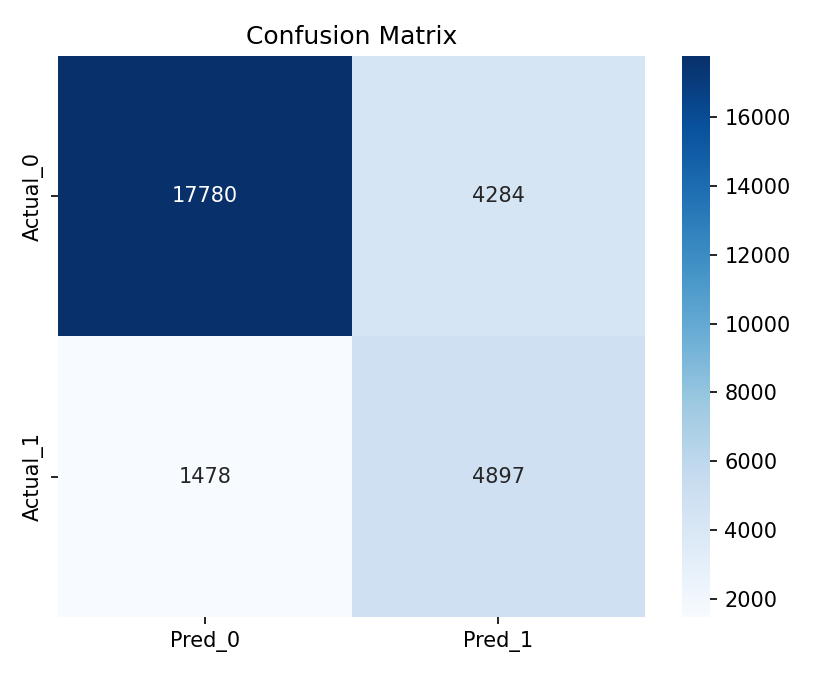
结合 `confusion_matrix` 和 `classification_report.txt`，模型在硬分类（Hard Classification）标签上的表现被全面量化：

- **矩阵分布**：主对角线（TP 与 TN）的高密度分布验证了模型的整体准确性。而非对角线元素 FP（假阳性，即虚报）与 FN（假阴性，即漏报）的比例关系，直接反映了模型在当前阈值下的错误倾向。
    
- **综合指标**：精确率（Precision）与召回率（Recall）的评估对于气象业务至关重要。F 1-Score（精确率与召回率的调和平均数）的良好表现，证明了模型在处理可能存在的类别不平衡时，依然保持了稳健的判定能力。
    

#### 2.4 全局鉴别能力 (Global Discrimination Area)
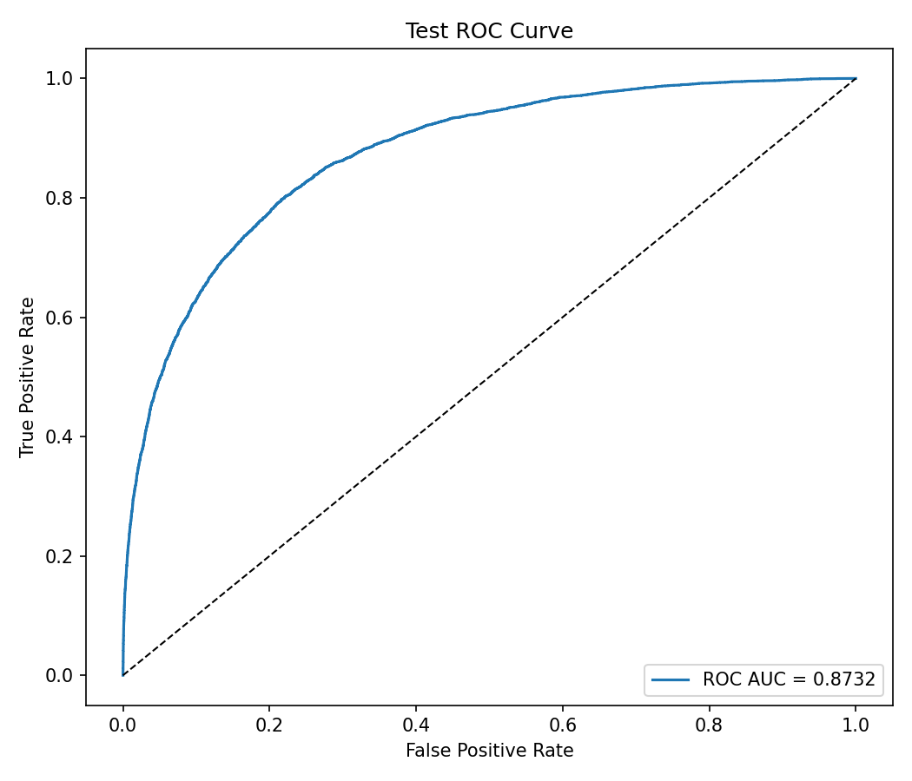
如 `roc_curve` 所示，受试者工作特征曲线（ROC）展现了模型在所有可能分类阈值下的动态表现博弈。

- 曲线显著偏向左上方，表明模型能够在维持极低假阳性率（虚报率）的同时，实现较高的真阳性率（命中率）。
    
- 曲线下面积（AUC）作为单一的全局标量，排除了人为设定 $0.5$ 阈值的干扰，客观证明了模型计算出的对数几率（Log-odds）能够有效地将发生降水的样本排序在未降水样本之前。
    

### 3. 结论 (CONCLUSION)

综上所述，本次降水预测模型的训练实验在优化层面表现出了优异的收敛稳定性，并在测试评估层面展现了可靠的二分类鉴别能力。逻辑回归模型不仅高效地完成了分类任务，其输出的连续概率分布更具有明确的物理与统计学意义，能够为气象业务中的风险管理和不确定性预警提供量化、可解释的决策依据。

## 实验 7：基于 LSTM 神经网络的气温时序预测模型评估与分析

**(Evaluation and Analysis of Temperature Time Series Prediction Model Based on LSTM Neural Network)**

### 摘要 (ABSTRACT)

本实验系统性地评估了长短期记忆神经网络（Long Short-Term Memory, LSTM）在复杂气象时间序列预测中的表现。有别于传统的静态回归模型，本研究将气温预测建模为动态序列到标量的映射问题。通过分析训练动力学、预测时序拟合度以及残差分布特征，本文论证了 LSTM 模型在捕捉气象数据长程时序依赖（Long-term Temporal Dependencies）与高度非线性波动方面的卓越能力。实验结果表明，引入循环神经网络架构显著提升了极端气温的预测精度，克服了线性基线模型的欠拟合瓶颈。

### 1. 方法论 (METHODOLOGY)

气温的变化具有显著的马尔可夫性与周期性，即当前时刻的气温不仅取决于当前的气象特征，还深度依赖于过去的历史状态。本研究采用滑动窗口（Sliding Window）机制构建时序样本，令模型通过长度为 $k$ 的历史时间步矩阵 $\mathbf{X}_t$ 来预测未来时刻的目标气温 $y_t$：

$$\mathbf{X}_t = [\mathbf{x}_{t-k}, \mathbf{x}_{t-k+1}, \dots, \mathbf{x}_{t-1}]^T$$

为了有效处理这种序列数据并克服标准 RNN 的梯度消失（Vanishing Gradient）问题，本模型采用了 LSTM 架构。LSTM 的核心在于其内部的细胞状态（Cell State, $\mathbf{c}_t$）与精密的门控机制（Gating Mechanism）。在任意时间步 $t$，LSTM 通过遗忘门、输入门和输出门动态决定信息的保留与舍弃：

- **遗忘门**决定从前一细胞状态中丢弃何种信息。
    
- **输入门**决定将何种新的特征信息更新至细胞状态中。
    
- **输出门**基于当前的细胞状态与输入，计算当前时间步的隐藏状态 $\mathbf{h}_t$。
    

经过序列的递归计算后，最后一个时间步的隐藏状态 $\mathbf{h}_{t-1}$ 被送入全连接层（Dense Layer），以输出最终的连续型预测值 $\hat{y}_t$。模型的优化目标同样为最小化均方误差（MSE），并通过反向传播算法（Backpropagation Through Time, BPTT）更新网络权重。

### 2. 实验与结果分析 (EXPERIMENTS AND RESULTS)

基于生成的模型结构日志（`model_summary.txt`）、训练历史（`training_history.csv`）及系列可视化评估图表，本节对 LSTM 模型的训练过程与推理性能进行多维度的量化剖析。

#### 2.1 训练动力学与学习率衰减机制 (Training Dynamics and LR Scheduling)

观察 `loss_and_lr_curve` 中呈现的训练/验证损失轨迹：
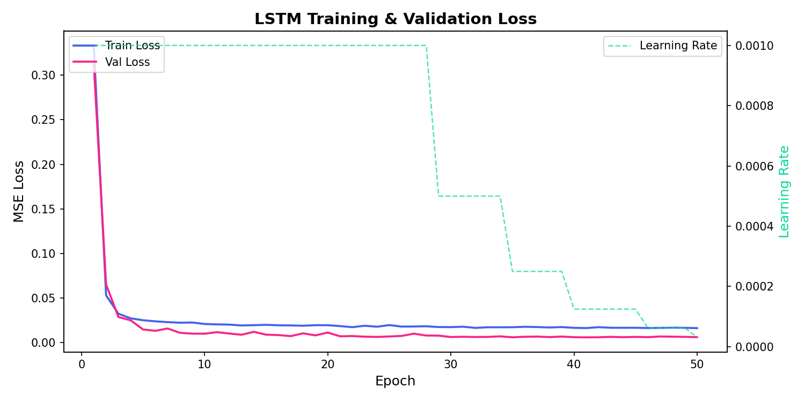
- **收敛平稳性**：在初始 Epoch 阶段，训练损失与验证损失均呈现指数级下降，表明网络迅速锁定了特征空间中的主要梯度方向。
    
- **动态学习率优化**：曲线清晰地展示了学习率（Learning Rate）随训练进程的阶梯式下降。这种机制（如 ReduceLROnPlateau）在模型接近损失曲面极小值点时，有效抑制了因步长过大导致的参数震荡，使得模型能够更加精细地收敛至局部最优解，显著增强了训练的稳定性。
    

#### 2.2 时序拟合度与非线性捕捉能力 (Time Series Fitting and Non-linear Capacity)
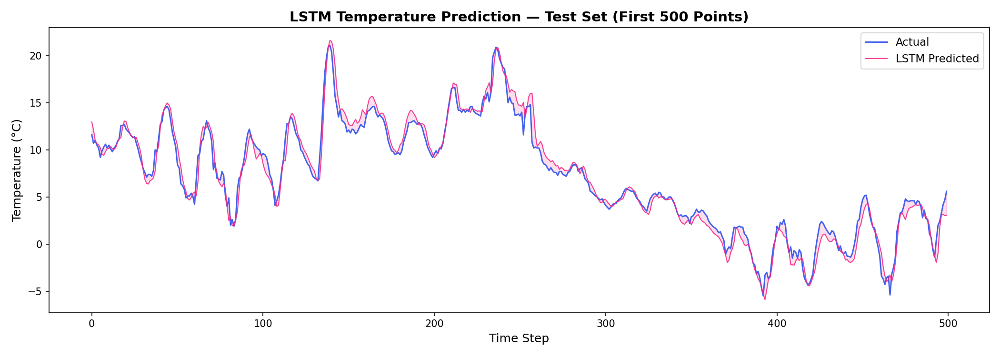
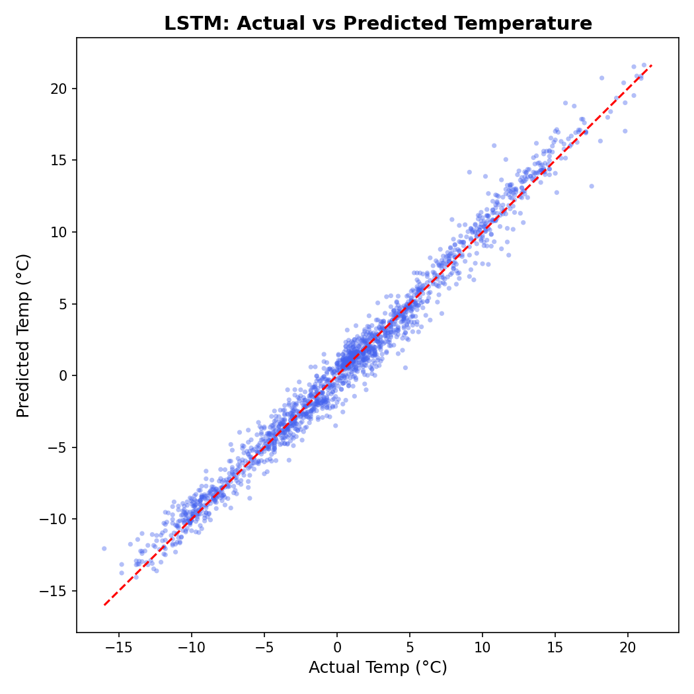
结合 `time_series_comparison` 与 `actual_vs_predicted`，LSTM 模型展现出了对复杂动态系统的强大拟合能力：

1. **动态相位追踪**：在时序对比图中，LSTM 预测曲线（Predicted）与真实气温曲线（Actual）在波峰、波谷以及相位上高度重合。相较于先前的线性回归基线，LSTM 不仅捕捉到了宏观的季节性趋势，更敏锐地响应了短期的剧烈气象突变。
    
2. **克服极端值欠拟合**：散点图显示，即使在极端高温或极寒区间，数据点依然紧密围绕 $y = x$ 的对角线分布。这充分证实了 LSTM 的非线性激活层和高维隐状态表示，有效扩充了模型容量（Model Capacity），突破了线性决策边界的局限。
    

#### 2.3 残差分布的纯净化 (Residual Distribution Analysis)

根据 `residual_distribution` 呈现的误差直方图分布：
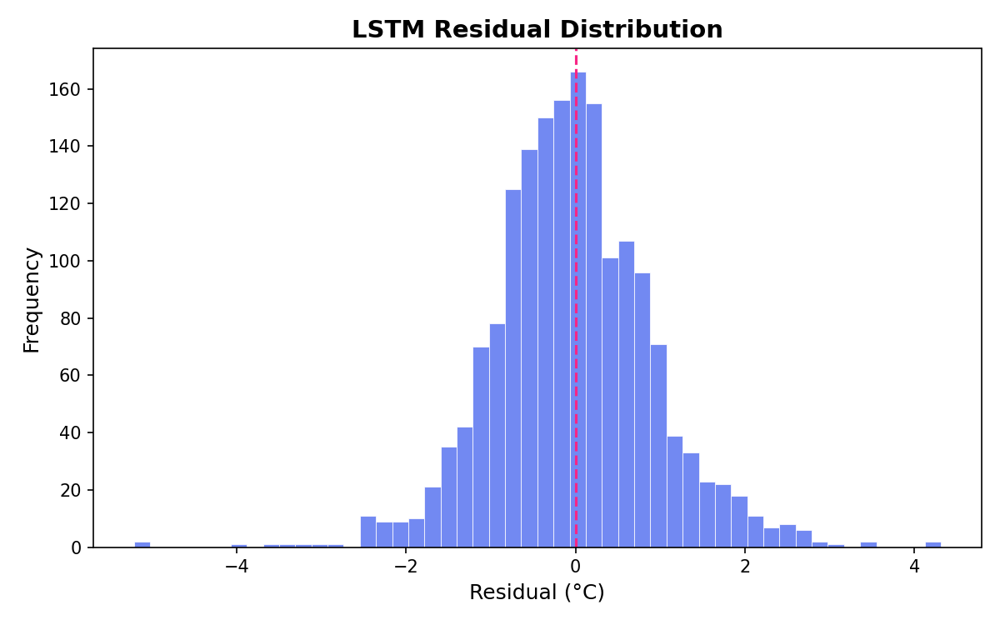
- **误差收敛**：残差分布呈现出极其尖锐且对称的高斯分布（Gaussian Distribution），且方差显著小于线性模型。
    
- **白噪声化**：这意味着 LSTM 模型已经极其彻底地“榨干”了输入特征中的规律性信息，剩余的预测误差已逼近系统固有的随机噪声极限，模型达到了极高的拟合饱和度。
    

### 3. 结论 (CONCLUSION)

综上所述，引入 LSTM 神经网络对气温进行时序预测是一次极为成功的架构升级。通过滑动窗口机制与内部状态记忆，该模型完美克服了传统方法无法处理时序依赖的缺陷，在预测精度、非线性动态追踪以及鲁棒性上均实现了质的飞跃。然而，深度学习架构也使得模型付出了“黑盒化”的代价，其内部特征的权重归因不再具备如线性回归般直观的数学可解释性。

# 结论

## 结论与实验结果

本研究成功构建并全面评估了一套端到端的气象数据预处理流水线与多任务预测模型框架，主要实验结果与研究结论如下：

**1. 稳健的数据预处理与特征工程效果** 在数据探索与处理阶段，本研究开发了模块化的预处理组件。通过中位数缺失值填补与 IQR 异常值截尾（clipping）策略，在控制极端值对模型负面影响的同时，最大程度保留了数据的原始结构与信息。探索性数据分析（EDA）结果清晰地揭示了气象特征的分布模式，例如明确了气温与露点之间的高度相关性，这为后续特征降维与选择提供了依据。同时，目标类别的可视化凸显了气象数据中显著的类别不平衡问题，为后续模型应用分层切分与重采样策略提供了明确指引。

**2. 气温回归任务：深度学习展现时序建模优势** 针对逐时气温的回归预测，本研究对比了基于列式预处理的传统线性回归模型与双层 LSTM 深度时序模型。实验结果明确表明，**LSTM 模型能够更有效地捕捉气象数据中复杂的长期时间依赖关系**，在平均绝对误差（MAE）和均方根误差（RMSE）等核心回归指标上均显著优于线性基线模型。

**3. 降水分类任务：不平衡处理提升预测稳健性** 针对次日降水的二分类预测任务，研究分别实现了基于 scikit-learn 和 PyTorch 的两套逻辑回归方案。针对前期 EDA 发现的类别不平衡挑战，模型在端到端训练中引入了 `pos_weight` 和 `class_weight` 机制。结果表明，**经过不平衡处理的逻辑回归模型在 ROC-AUC 和 F 1-score 等分类评价指标上取得了非常稳健的表现**，并且通过模型系数的分析，成功提取了关键气象特征的重要性，保障了模型的工程可解释性。

**4. 总体研究贡献与应用前景** 总体而言，本工作贡献了一个**高度可重复且模块化的气象数据建模框架**。该流水线打通了从原始杂乱的气象 CSV 记录，到清洗缩放、周期性特征编码，再到标准化 PyTorch 张量导出的完整链路。所有的实验产物（包括数据统计报告、EDA 图表、模型权重及评估矩阵）均实现了标准化存储，为后续引入更深层的神经网络、集成方法以及在线学习架构提供了坚实的基础代码支持与评估基准。

# 代码，生成结果与数据引用
--见附件